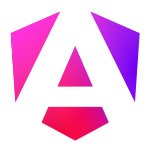
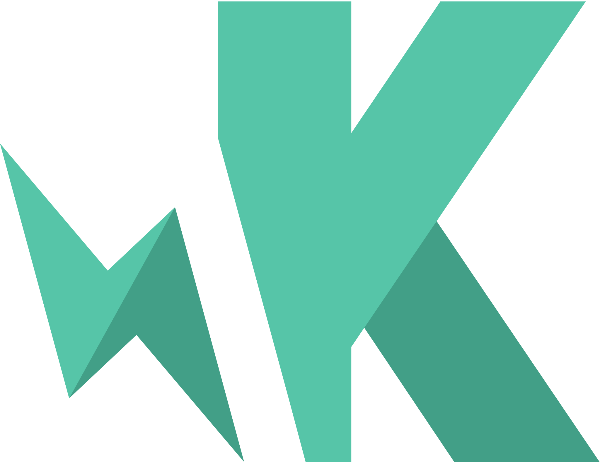

## Hi there 👋, I'm Harsha C G

Welcome to my GitHub repository! I am Harsha, a seasoned Senior Technical Manager in Frontend Engineering with over 14 years of experience across various industries. My expertise lies in enhancing software architectures, refining user experiences, and mentoring diverse teams to achieve continuous innovation and excellence in project delivery.

## About Me

I specialize in frontend development and have a proven track record of leading teams to deliver high-impact projects. My experience spans multiple domains, including Beverages, Lifestyle, FMCG, AI, E-Commerce, Advertising & Marketing, and Cloud Technologies.

With extensive hands-on experience as a Frontend Engineer, I focus on creating scalable and accessible solutions tailored for diverse industries. I provide strategic guidance, enhance software architectures, and lead frontend development teams to deliver exceptional projects. Additionally, I am proficient in Test Driven Development (TDD), ensuring robust and maintainable code across all projects.

**Location:** Bengaluru, Karnataka, India

## Skills
              

<!--
**cgharsha/cgharsha** is a ✨ _special_ ✨ repository because its `README.md` (this file) appears on your GitHub profile.

Here are some ideas to get you started:

- 🔭 I’m currently working on ...
- 🌱 I’m currently learning ...
- 👯 I’m looking to collaborate on ...
- 🤔 I’m looking for help with ...
- 💬 Ask me about ...
- 📫 How to reach me: ...
- 😄 Pronouns: ...
- ⚡ Fun fact: ...
-->
